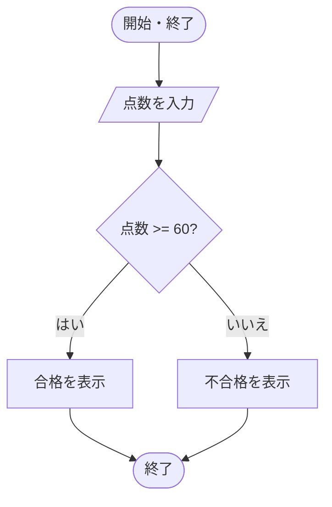

# 第2章・第3話　分岐と繰返し・流れ図――手順の道筋を三つの形で表す

プログラムの流れは、順次、選択、繰返しという三つの形を組み合わせて作れます。
順次は上から順に処理し、選択は条件で道を分け、繰返しは条件に従って同じ処理を何度か行います。
これを、構造化プログラミングの基本制御構造と呼びます。

条件を細かく分けるほど、複雑な入力へ対応できます。
一方で、複数の条件が重なる場合と、どの条件にも当てはまらない場合を調べる必要があります。
繰返しでは、処理を行う範囲に加えて、いつ終了するかも定めます。
同じ処理を文章、擬似コード、流れ図、決定表に表して、条件と実行順を確かめます。

## 値の依存関係と、条件による選択

### 1 順次――前の結果を次へ渡す

```text
price = 1000
tax = price * 0.1
total = price + tax
```

価格を保存し、その値から税額を計算し、最後に税込価格を求めます。
上から1文ずつ実行するため、前の結果を次の文が使います。

```text
開始
 ↓
priceへ1000
 ↓
taxを計算
 ↓
totalを計算
 ↓
終了
```

順番を入れ替えると、まだ値のない変数を読むことがあります。
データの依存関係を見ます。

### 2 if文――条件が真のときだけ行う

```text
もし temperature > 30 なら
    "暑い"を表示する
```

常に実行する処理に対し、条件が成り立ったときだけ行う処理にはif文を使います。
この例では、条件`temperature>30`を評価します。

- 真なら、字下げされた文を実行。
- 偽なら、その部分を飛ばす。

30ちょうどを含むかは、`>`と`>=`で違います。

### 3 if-else――二つの道から一つを選ぶ

```text
もし score >= 60 なら
    result = "合格"
そうでなければ
    result = "不合格"
```

条件が偽の場合の処理も定めると、2つの枝のどちらか一方だけを通ります。

| score | `score>=60` | result |
|---:|---|---|
| 59 | 偽 | 不合格 |
| 60 | 真 | 合格 |

境界値59、60、61を試すと、比較記号の誤りを見つけやすくなります。

### 4 else-if――三つ以上に分ける

点数を三つ以上の区分へ分けるときは、条件の順序も結果を変えます。
最初に真になった枝だけを通るため、広い条件を先に置くと、狭い条件へ到達できません。

点数を評価にします。

```text
もし score >= 80 なら
    grade = "A"
そうでなく score >= 60 なら
    grade = "B"
そうでなければ
    grade = "C"
```

上から順に条件を試し、最初に真になった枝だけを実行します。

次の順序では、90点でも最初の`>=60`が真なのでBになり、Aの枝に到達しません。

```text
もし score >= 60 なら B
そうでなく score >= 80 なら A
```


### 5 条件の重なりと漏れ

年齢を次の区分に分ける場合も、条件の境界を確かめます。

```text
0～12 子ども
13～17 未成年
18以上 成人
```

条件は、次の二つを満たすようにします。

- 重ならない。
- 許された入力全体を覆う。

負の年齢や、数値でない入力をどう扱うかも必要です。

### 6 ネスト――分岐の中に分岐を置く

```text
もし userExists なら
    もし passwordCorrect なら
        login = true
    そうでなければ
        login = false
そうでなければ
    login = false
```

内側に入れ子になることをネストと呼びます。

深すぎるネストは読み間違えやすくなるため、次の方法などで浅くします。

- 早めにエラーを返す。
- 条件を名前付きの関数に分ける。
- 同じ結果の枝を論理式でまとめる。

## 繰り返す範囲と、条件を調べる時点

### 7 while――条件が真の間、繰り返す

条件に合う間、同じ処理を繰り返すにはwhileを使います。
次のコードは、1から5まで表示します。

```text
i = 1
while i <= 5
    iを表示する
    i = i + 1
```

条件を調べる時点と、本体実行後の値を分けて追います。

| 回 | 条件を調べる時のi | 条件 | 表示 | 更新後i |
|---:|---:|---|---:|---:|
| 1 | 1 | 真 | 1 | 2 |
| 2 | 2 | 真 | 2 | 3 |
| 3 | 3 | 真 | 3 | 4 |
| 4 | 4 | 真 | 4 | 5 |
| 5 | 5 | 真 | 5 | 6 |
| 終了 | 6 | 偽 | なし | 6 |


### 8 ループの四つの部品

カウンタを使うループでは、次を確認します。

1. `i=1`で初期化する。
2. `i<=5`なら継続する。
3. 本体で表示などを行う。
4. `i=i+1`で更新する。

更新を忘れると`i`が1のままで、条件が永遠に真となる無限ループになります。

### 9 for――回数や要素が分かる繰返し

回数が分かる場合は、次のようにforで表せます。

```text
for i = 1 から 5 まで
    iを表示する
```

要素を順に処理する場合には、次の書き方もあります。

```text
for each name in names
    nameを表示する
```

何回繰り返すか、どの要素を順に見るかが明確なとき使います。

「1から5まで」が5を含むかは、擬似言語や実在言語の規則を確認します。

### 10 前判定と後判定

繰り返す条件が同じでも、本体の前後のどちらで判定するかによって、最小実行回数が違います。

#### 前判定

本体の前に条件を調べます。
最初から偽なら0回です。

```text
while 条件
    本体
```


#### 後判定

本体を1回行った後で条件を調べます。
必ず1回以上実行します。

```text
do
    本体
while 条件
```

利用者に一度は入力を求め、その後で続けるか聞く場面などに使えます。

## 集計する値と、空入力の扱い

### 11 番兵値――特別な入力で終える

点数を何件受け取るか事前に分からず、`-1`が来たら終了するとします。

```text
total = 0
count = 0
scoreを入力
while score != -1
    total = total + score
    count = count + 1
    scoreを入力
```

終了を示す特別な値を番兵値、sentinel valueと呼びます。

実際の点数として-1があり得ないことが前提です。
すべての数値が有効なら、別の終了信号を使います。

### 12 合計、件数、最大値の型

集計の初期値は、求める値によって変えます。
合計と件数には0が合いますが、最大値まで0にすると、入力がすべて負のときに存在しない0が答えになります。

#### 合計

```text
total = 0
各valueについて
    total = total + value
```

加算の単位元0で初期化します。

#### 件数

```text
count = 0
条件に合うたび
    count = count + 1
```


#### 最大値

```text
maxValue = 最初の要素
二番目以降の各valueについて
    もし value > maxValue なら
        maxValue = value
```

0で初期化すると、全値が負の場合に0という存在しない最大値になります。
最初の要素を使うか、まだ値がない状態を別に管理します。

### 13 0回の入力を考える

繰返しの例には、1回以上実行するものが多くあります。
前判定のループでは、最初の判定が偽なら本体は一度も実行されません。
空の入力は例外ではなく、ループが取り得る通常の状態です。

平均を求める式では、件数が0でないことも確かめます。

```text
average = total / count
```

件数が0なら、この式は0除算になります。

```text
もし count > 0 なら
    average = total / count
そうでなければ
    データなしとして扱う
```

空の入力は、多くのアルゴリズムの境界例です。

## 境界と、途中から移る制御

### 14 off-by-oneエラー

1つずれた境界による誤りをoff-by-oneエラーと呼びます。

要素が5個で番号が0から4なら、処理する添字は次のとおりです。

```text
i=0,1,2,3,4
```

条件を`i<=5`にすると、存在しない添字5の要素を読みます。
継続条件を`i<5`とします。

要素数、最後の添字、継続条件の関係を図にします。

```text
要素数n
0開始なら最後はn-1
条件はi<n
```


### 15 breakとcontinue

ループ本体の途中から制御を移す命令では、ループ全体を終えるか、現在回だけを打ち切るかを区別します。
`break`はループ自体を終え、`continue`は現在回だけを打ち切ります。

#### break

現在のループを途中で終了します。

#### continue

現在回の残りを飛ばし、次回に進みます。

便利ですが、多用すると入口と出口が増え、流れを追いにくくなります。
言語によっては、どのネストのループを抜けるかにも注意します。

### 16 無限ループが必要な場合

サーバや組込み制御は、停止命令まで要求を待ち続けることがあります。

```text
while true
    requestを待つ
    requestを処理する
```

意図的な無限ループでも、次の点を設計します。

- 停止要求をどう受けるか。
- エラー後も回り続けるか。
- 資源を解放するか。
- CPUを無駄に100%使わないか。

## 途中の正しさと、停止する理由

### 17 ループ不変条件

1から`n`までの和を求めます。

```text
sum = 0
i = 1
while i <= n
    sum = sum + i
    i = i + 1
```

各回の先頭では、次の関係が成り立ちます。

```text
sumは1からi-1までの和である
```

- 開始時`i=1`で、1から0までの和は空の和0なので成り立つ。
- 1回でiを足し、iを1増やすので次回も成り立つ。
- 終了時`i=n+1`なので、sumは1からnまでの和。

このように、各回の境界で保たれる関係を**ループ不変条件**と呼びます。
不変条件は、ループが正しいことを説明する道具です。

### 18 停止性

上のループは、`n-i+1`という残り回数が毎回1減り、0以下になれば終わります。

終了することを示すには、次の三点を示します。

- 毎回一定方向に変わる量がある。
- その量に越えられない下限または上限がある。
- 終了条件に必ず到達する。

## コードの分岐と繰返しを図に対応させる

### 19 流れ図の基本記号

流れ図、フローチャートは、処理の流れを図で表します。

#### 端子

開始と終了を表す角の丸い形です。

#### 処理

計算や代入を表す長方形です。

#### 判断

条件による分岐を表すひし形です。
出口に真・偽、はい・いいえを書きます。

#### データ

入力・出力を表す平行4辺形です。

#### 定義済み処理

別に定義された関数や手続の呼出しを、左右に二重線のある長方形などで表します。

#### ループ端

試験の流れ図では、繰返し範囲を示す専用の記号が使われることがあります。

#### 線

矢印で実行順をつなぎます。
線の交差と接続を混同しないよう、接続点を示します。

### 20 if文を流れ図へする

60点以上なら合格、それ以外なら不合格とする分岐を、図に対応させます。

```text
        開始
          ↓
    scoreを入力
          ↓
    <score>=60?>
      /       \
    真         偽
    ↓          ↓
 合格を表示  不合格を表示
      \       /
          ↓
         終了
```

判断記号から出る線に、どちらが真か書きます。

#### 標準流れ図記号の対応



端子は丸みのある開始・終了、入出力は平行4辺形、処理は長方形、判断はひし形です。
同じ処理の擬似コードは`入力→if 点数≥60 then 合格 else 不合格→終了`です。

### 21 whileを流れ図へする

1から5まで表示するwhileも、条件の判定と更新を図で追えます。

```text
開始
 ↓
i=1
 ↓
<i<=5?> ─偽→ 終了
  |
  真
  ↓
iを表示
  ↓
i=i+1
  └────→ 条件へ戻る
```

更新から条件に戻る線が必要です。

## 条件の組み合わせと、処理の漏れ

### 22 決定表――条件の組合せを漏れなく並べる

条件の組み合わせを漏れなく確かめるには、分岐の線だけでなく、各組み合わせを列として並べる決定表も使えます。
送料無料となる次の二条件を考えます。

- 会員か。
- 購入額が5000円以上か。

| 条件・動作 | 規則1 | 規則2 | 規則3 | 規則4 |
|---|---|---|---|---|
| 会員 | はい | はい | いいえ | いいえ |
| 5000円以上 | はい | いいえ | はい | いいえ |
| 送料無料 | 実行 | 実行 | 実行 | しない |

この例では、どちらか一方でも真なら無料です。

決定表は、条件が増え、ifの入れ子では組合せの漏れを見つけにくいときに役立ちます。

### 23 条件数と規則数

独立な真偽条件が`n`個なら、全組合せは`2ⁿ`通りです。

条件が3個なら8通り、4個なら16通りです。

ただし、現実には同時に起きない組合せや、結果が同じでまとめられる列があります。
ハイフンを「どちらでもよい」として簡略化できます。

安全上重要な条件を「どちらでもよい」にしてはいけません。

真偽条件が1つなら`真,偽`の2通りです。
2つ目を加えると各行が新条件の真・偽に分かれて4通り、3つなら8通りです。
したがって独立に真偽を列挙するn条件の組合せは`2×2×…×2=2ⁿ`通りです。

### 24 ガード節――異常条件を先に返す

異常条件を先に返すと、正常処理を深いネストの内側に置かずに済みます。

```text
関数 withdraw(amount)
    もし amount <= 0 なら
        エラーを返す
    もし amount > balance なら
        残高不足を返す
    balance = balance - amount
    成功を返す
```

異常条件を先に確認し、正常処理を浅い場所に置く形をガード節と呼びます。

### 25 制御構造を選ぶ問い

- 常に順に行うか。
- 条件で1つだけ選ぶか。
- 回数が決まっているか。
- 終了条件まで続けるか。
- 最低1回は実行するか。
- 途中で発見したら終了してよいか。
- 空入力はあるか。
- 境界値を含むか。

文法より先に、この問いで流れを決めます。

点数の分岐では境界と条件の順序を、1から5までの表示では初期値、更新、終了条件を確かめました。
順次、選択、繰返しの形が分かっても、許された入力をすべて扱い、意図した時点で止まることは別に確かめます。
